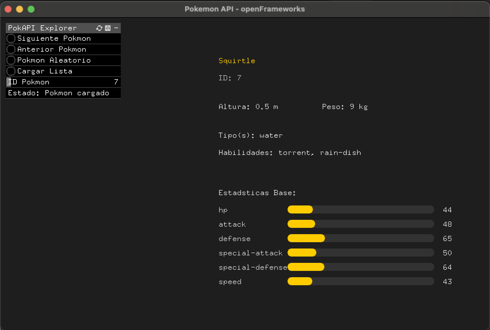

# PokéAPI Explorer - openFrameworks

Una aplicación de escritorio desarrollada en openFrameworks para explorar datos de Pokémon usando la PokéAPI.

## 📸 Captura de Pantalla



*Interfaz de la aplicación mostrando información detallada de Squirtle (ID: 7) con controles de navegación y estadísticas base.*

## 🎮 Características

- **Interfaz profesional** con `ofxGui` para controles nativos
- **Navegación fluida** por Pokémon individuales (1-151)
- **Información detallada** de cada Pokémon:
  - Nombre, ID, altura, peso
  - Tipos y habilidades
  - Estadísticas base con visualización gráfica
- **Lista de Pokémon** con scroll y selección
- **Controles múltiples**: Mouse, teclado y GUI
- **Sistema de fallback** para renderizado de texto robusto

## 🛠️ Tecnologías

- **openFrameworks 0.12.1** - Framework principal
- **ofxJSON** - Parsing de datos JSON de la API
- **ofxGui** - Interfaz de usuario profesional
- **PokéAPI** - Fuente de datos de Pokémon
- **C++** - Lenguaje de programación

## 📋 Requisitos

- macOS 10.15+
- openFrameworks 0.12.1
- Xcode (para compilación)

## 🚀 Instalación y Uso

### Compilación
```bash
# Compilar la aplicación
make -f Makefile.dev build

# Ejecutar
make -f Makefile.dev run
# o
open bin/of_apis_project2.app
```

### Controles
- **GUI**: Botones y slider en panel lateral
- **Teclado**: 
  - `N` - Siguiente Pokémon
  - `P` - Anterior Pokémon  
  - `R` - Pokémon aleatorio
  - `L` - Cargar lista
  - `ESPACIO` - Pokémon aleatorio
- **Mouse**: Interacción completa con la GUI

## 📁 Estructura del Proyecto

```
of_apis_project2/
├── src/
│   ├── ofApp.h          # Declaraciones de clase
│   ├── ofApp.cpp        # Lógica principal
│   └── main.cpp         # Punto de entrada
├── bin/data/            # Recursos (fuentes, etc.)
├── addons.make          # Addons de openFrameworks
├── Makefile.dev         # Makefile personalizado
├── config.make          # Configuración del proyecto
└── README.md            # Este archivo
```

## 🔧 Desarrollo

### Makefile Personalizado
El proyecto incluye `Makefile.dev` con comandos útiles:

```bash
make -f Makefile.dev help     # Ver todos los comandos
make -f Makefile.dev build    # Compilar
make -f Makefile.dev run      # Ejecutar
make -f Makefile.dev clean    # Limpiar
make -f Makefile.dev status   # Estado del proyecto
```

### Addons Utilizados
- `ofxJSON` - Para parsing de JSON y llamados HTTP
- `ofxGui` - Para interfaz de usuario

### Configuración de la API
La aplicación consume la **PokeAPI** con los siguientes endpoints:

- **Pokémon individual**: `https://pokeapi.co/api/v2/pokemon/{id}`
- **Lista completa**: `https://pokeapi.co/api/v2/pokemon?limit=151&offset=0`

#### Funciones de API:
- `loadPokemon(int id)` - Carga un Pokémon específico
- `loadPokemonList()` - Carga lista de 151 Pokémon
- **Llamados síncronos** usando `ofxJSON::open(url)`
- **Manejo de estados** con variables booleanas
- **Manejo de errores** con mensajes al usuario

#### Estructura de Datos:
```cpp
ofxJSON pokemonData;        // Datos de Pokémon individual
ofxJSON pokemonListData;    // Lista de todos los Pokémon
bool isLoading;             // Estado de carga
bool hasPokemonData;        // Datos cargados
bool hasListData;           // Lista cargada
```

## 🎨 Características de la UI

- **Tema oscuro** con acentos dorados
- **Fuentes TTF** con fallback a bitmap
- **Layout de dos columnas** (controles | información)
- **Barras de estadísticas** visuales
- **Panel de control** con botones nativos

## 📊 API Utilizada

- **PokéAPI**: https://pokeapi.co/
- **Endpoints**:
  - `/api/v2/pokemon/{id}` - Pokémon individual
  - `/api/v2/pokemon?limit=151` - Lista de Pokémon

## 🐛 Solución de Problemas

### Texto no visible
La aplicación incluye un sistema de fallback automático que usa `ofDrawBitmapString` si las fuentes TTF no se cargan correctamente.

### Compilación
Asegúrate de tener openFrameworks instalado y la variable `OF_ROOT` configurada correctamente.

## 📝 Licencia

Este proyecto es de código abierto y está disponible bajo la licencia MIT.

## 👨‍💻 Autor

**Assiz Alcaraz Baxter**

Desarrollado como parte de la materia "Imagen y sonido en tiempo real" - UNA 2025.

---

**Nota**: Este proyecto es una demostración educativa del uso de openFrameworks para consumir APIs REST y crear interfaces gráficas profesionales.